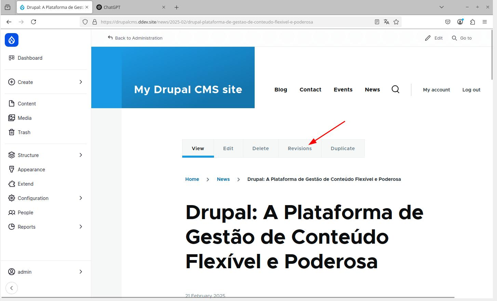
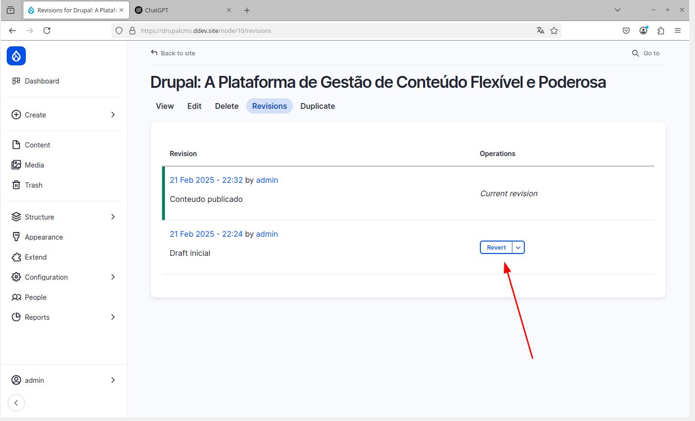
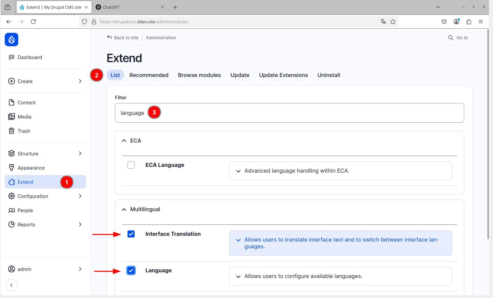
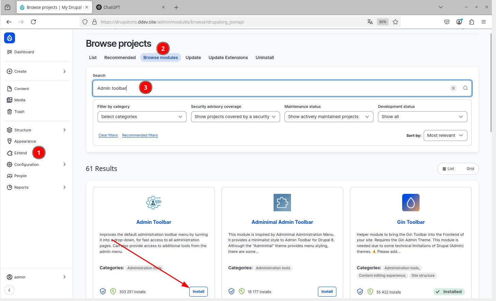
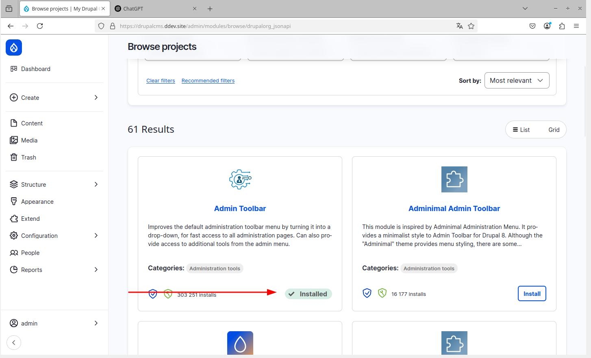
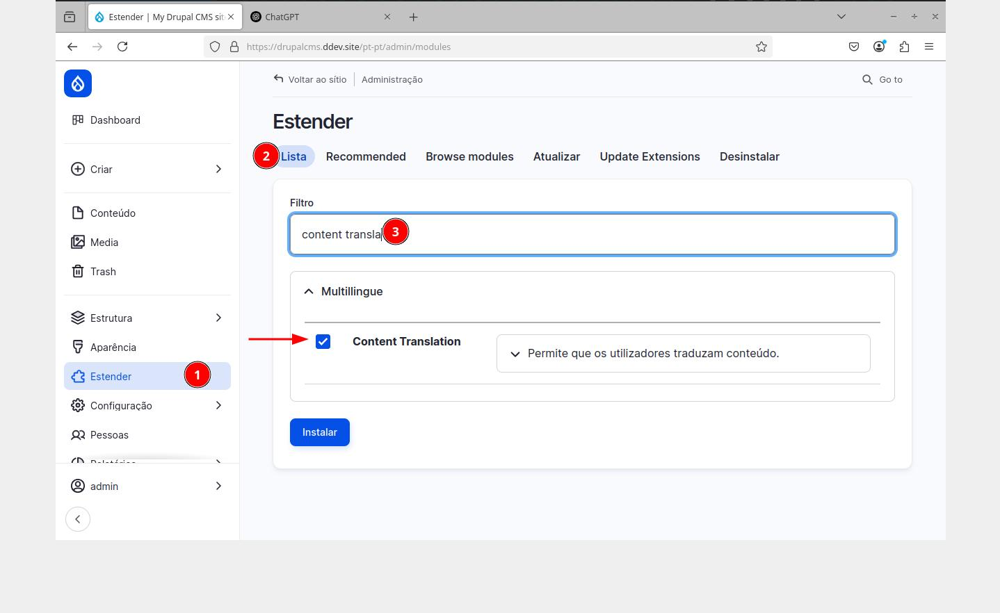

# Preparing the Local Development Environment

## DDEV is not installed on my host

1. **Install VirtualBox**:

    - Download VirtualBox from: [https://www.virtualbox.org/wiki/Downloads](https://www.virtualbox.org/wiki/Downloads)
    - Run the installer and follow the standard instructions.
2. **Import the Virtual Application (OVA)**:

    - Open VirtualBox and select "Import Appliance".
    - Navigate to the `.ova` file provided on the USB drive and select it.
    - Ensure the option "Generate new MAC addresses for all network adapters" is selected.
    - Confirm and wait for the virtual machine to import.
3. **Start the Virtual Machine**:

    - Select the imported virtual machine and click "Start".
    - Log in with the default credentials: user "ectl" and password "ectl".

### Configure DDEV (Local Server)

DDEV simplifies the configuration of development environments for web projects. For this workshop, DDEV is pre-installed and configured for the Drupal CMS project. For more information on installing and configuring DDEV, see:

- Installation: [https://ddev.readthedocs.io/en/stable/users/install/ddev-installation/](https://ddev.readthedocs.io/en/stable/users/install/ddev-installation/)
- Drupal Quick Start: [https://ddev.readthedocs.io/en/latest/users/quickstart/#drupal-drupal-cms](https://ddev.readthedocs.io/en/latest/users/quickstart/#drupal-drupal-cms)

**Start the DDEV Project**:

- Open the terminal/command line.
- Navigate to the Drupal CMS project folder: `cd Sites/drupalcms`
- Start DDEV: `ddev start`
- Open the Virtual Machine's browser.
- Access the Drupal website via: [https://drupalcms.ddev.site](https://drupalcms.ddev.site)

## DDEV is installed on my host

- Clone the workshop repository: [https://gitlab.com/fmfpereira/workshop-drupal-cms](https://gitlab.com/fmfpereira/workshop-drupal-cms)
    - Run the command: `git clone https://gitlab.com/fmfpereira/workshop-drupal-cms.git`
- Start DDEV: `ddev start`
- Install dependencies: `ddev composer install`
- Access the Drupal website via: [https://drupalcms.ddev.site](https://drupalcms.ddev.site)

## Install Drupal CMS

1. **Access the Installation Page**: [https://drupalcms.ddev.site](https://drupalcms.ddev.site)
    - When you visit the website for the first time, you will be redirected to the Drupal installation page.
2. **Configure the Installation**:
    - Select the "Blog" option.
    - Define the website name.
    - Create a user and set a secure password.
        - The first user to register will automatically be designated as the site's super administrator.
    - Wait for the installation to complete.

{width=60%}

{width=60%}

## Add Features with Recipes (Add-ons)

1. **Explore the Dashboard**:
    - After installation, the Drupal dashboard will be displayed.
2. **Install Recommended Add-ons**:
    - Select "*Choose recommended add-ons*".
    - Install the following add-ons:
        - Events
        - News
        - Forms
        - Search
3. **View New Content**:
    - In the Dashboard, explore the new listings and content entries: blogs, news, events, and contact form.

{width=60%}

{width=60%}

{width=60%}

## Create Content

1. **Create News, Blog Posts, and Events**:
    - Navigate through the news, blog, and events listings.
    - Create new content.
2. **Manage Content Options**:
    - Observe the publishing, scheduling, SEO, and authoring options.

By default, when you create new content, a revision is automatically generated. The content is not published immediately, being initially defined as a draft. To publish the content, use the option available in the right sidebar and set the status to "published". Additionally, you can customize various content settings, such as:

- Prevent the content from appearing in search results.
- Schedule the publication and unpublication of the content.
- Modify the content's URL.
- Change the author and publication date.

{width=60%}

{width=60%}

{width=60%}

{width=60%}

## Manage Content Revisions

1. **Access the Content List**:
    - Navigate to the "Content" section in the left sidebar.
2. **Edit and Create Revisions**:
    - Edit existing content and save the changes.
    - View the available revisions in the "Revisions" tab.
3. **Restore Previous Revisions**:
    - Explore the option to restore previous versions of the content.

{width=60%}

{width=60%}

{width=60%}

## Manage Modules

Before activating a module, it is necessary to download it. By default, Drupal CMS already includes some available modules. Some are activated, and others are awaiting activation.

### List and activate available modules

**Explore the Module List**:

- Navigate to "Extend" and then "List".
- Observe the available, activated, and non-activated modules.
- Activate the "Language" and "Interface translation" modules.

{width=60%}

### Install - List, download, and activate new modules.

**Explore the Module List**:

- Navigate to *Browse modules*.
- Observe and explore the available modules, such as "Admin toolbar".

{width=60%}

{width=60%}

### Translate the Website to Portuguese

The Coffee module comes pre-installed and allows you to quickly access any administration page with just a few keystrokes.

1. **Use the Coffee Module**:
    - Activate Coffee with `Alt + D` (or the corresponding shortcut).
    - Search for "Languages" and select the option.
2. **Install the Portuguese (Portugal) Language**:
    - Add the Portuguese (Portugal) language.
    - Wait for the Drupal translations to download.
3. **Configure the Language Switcher Block**:
    - Navigate to "Structure" and then "Block layout".
    - Add the "Language switcher" block to the desired region (e.g., Content above).
4. Activate and Configure the Content Translation Module:
    - Navigate to "Extend" and then "List".
    - Activate the "Content translation" module.
    - Navigate to "Configuration" and then "Regional and Language" and then "Content Language and Translation".
    - Select 'Content', select the content types, define as 'Translatable' and activate the 'Show language selector' option.
5. **Translate Content**:
    - Access the homepage.
    - Edit and re-save the English version (there is a bug in Drupal where it is only possible to translate content created before the activation of translations when the original content is re-saved).
    - Change the site's language to Portuguese.
    - Translate the homepage and other relevant content and see the result.

{width=60%}

{width=60%}

{width=60%}

{width=60%}

{width=60%}

{width=60%}

{width=60%}

{width=60%}

{width=60%}

{width=60%}

{width=60%}

{width=60%}

{width=60%}

{width=60%}

### Update the Website and Modules

1. **Activate the Diff Module**:
    - Navigate to "Extend" and then "List".
    - Activate the "Diff" module.
    - This module is intentionally outdated to demonstrate how to perform an update.
2. **Update Outdated Modules**:
    - Navigate to "Extend" and then "Update extensions".
    - Update the "Diff" module (and other outdated modules).
3. Experiment with the new module to compare Content Revisions**:
    - Edit content and create a new revision.
    - Select the "Revisions" tab.
    - Use the "Compare Revisions" function to view the differences.

{width=60%}

{width=60%}

{width=60%}

{width=60%}

{width=60%}