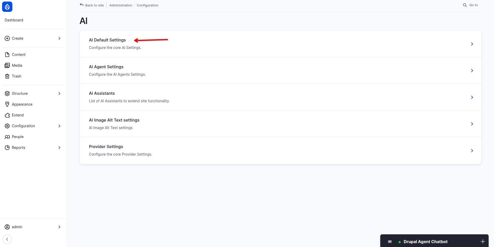
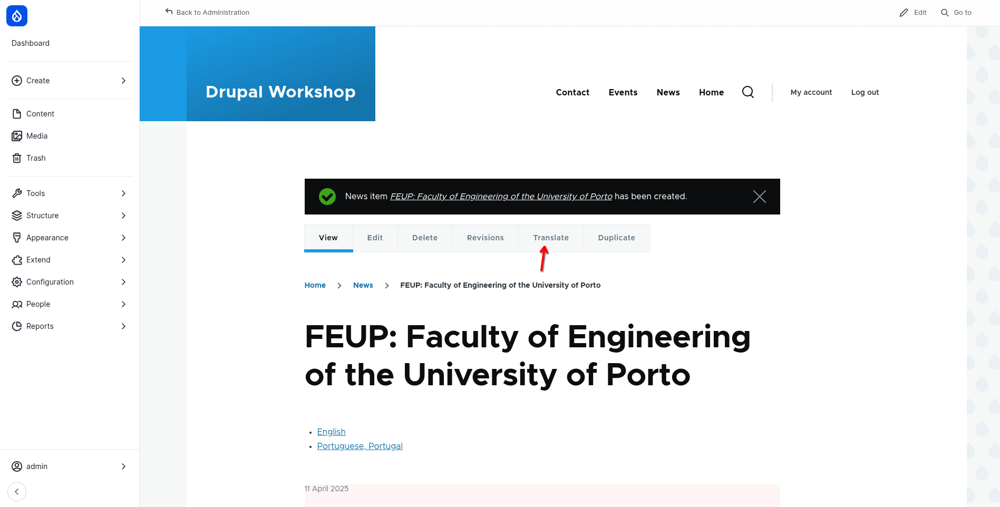
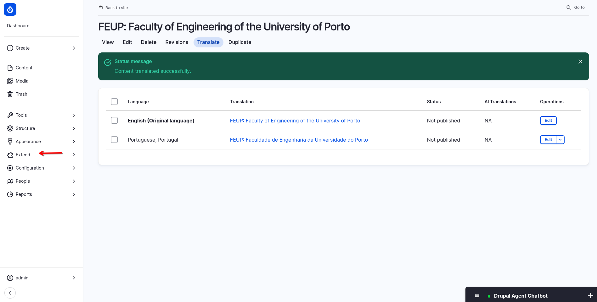

# Workshop DrupalCMS e AI

## Preparar o Ambiente de Desenvolvimento Local

### Instalar e configurar o DDEV

O DDEV simplifica a configuração de ambientes de desenvolvimento para projetos web. Para este workshop, o DDEV já está pré-instalado e configurado para o projeto Drupal CMS. Para mais informações sobre a instalação e configuração do DDEV, consultar:
- Instalação: [https://ddev.readthedocs.io/en/stable/users/install/ddev-installation](https://ddev.readthedocs.io/en/stable/users/install/ddev-installation/ )
- Guia Rápido Drupal: [https://ddev.readthedocs.io/en/latest/users/quickstart/#drupal-drupal-cms](https://ddev.readthedocs.io/en/latest/users/quickstart/#drupal-drupal-cms)

### Obter e iniciar o projeto

- Clonar o repositório do workshop: [https://gitlab.com/fmfpereira/workshop-drupal-cms](https://gitlab.com/fmfpereira/workshop-drupal-cms "null")
    - Executar o comando: `git clone https://gitlab.com/fmfpereira/workshop-drupal-cms.git`
- Iniciar o DDEV: `ddev start`
- Instalar as dependências: `ddev composer install`
- Aceder ao website Drupal através de: [https://drupalcms.ddev.site](https://drupalcms.ddev.site "null")

## Instalar o Drupal CMS

1. **Aceder à Página de Instalação**: [https://drupalcms.ddev.site](https://drupalcms.ddev.site)
    - Ao visitar o website pela primeira vez, o utilizador será redirecionado para a página de instalação do Drupal.
2. **Configurar a Instalação**:
    - Selecionar a funcionalidade blog.
    - Definir o nome do website.
    - Criar um utilizador e definir uma palavra-passe segura.
        - O primeiro utilizador a registar-se será automaticamente designado como super administrador do site.
    - Aguardar a conclusão da instalação.

Exemplos

{width=60%}

{width=60%}

## Adicionar Funcionalidades com Receitas (Add-ons)

1. **Explorar o Dashboard**:
    - Após a instalação, o dashboard do Drupal será exibido.
2. **Instalar Add-ons Recomendados**:
    - Selecionar "_Choose recommended add-ons_".
    - Instalar os seguintes add-ons:
        - Events
        - News
        - Forms
        - Search
        - Blog
3. **Visualizar Novos Conteúdos**:
    - No Dashboard explorar as novas listagens e entradas de conteúdo: blogs, notícias, eventos e formulário de contacto.

Exemplos

{width=60%}

{width=60%}

{width=60%}

## Instalar e ativar o suporte multilíngue

### Instalar os módulos

1. Navegar para "_Extend_" e depois "_List_".
2. Ativar os módulos "_Language_", "_Interface translation_" e "_Content translation_".

### Configurar o suporte multilíngue

O Módulo Coffee já vem instalado e permite aceder rapidamente a qualquer página de administração com apenas algumas teclas.
1. **Utilizar o Módulo Coffee**:
    - Ativar o Coffee com `Alt + D` (ou atalho correspondente).
    - Pesquisar por "_Languages_" e selecionar a opção.
2. **Instalar o Idioma Português (Portugal)**:
    - Adicionar o idioma Português (Portugal).
    - Aguardar o download das traduções do Drupal.
3. **Configurar o Bloco de Mudança de Idioma**:
    - Navegar para "_Structure_" e depois "_Block layout_".
    - Adicionar o bloco "_Language switcher_" à região desejada (ex. Content above)
4. **Configurar o Módulo Content Translation**:
    - Navegar para "_Configuration_" e depois "_Regional and Language_" e depois "_Content Language and Translation_".
    - Selecionar "_Content_", selecionar todos os tipos de conteúdo, definir como "*Translatable*" e ativar a opção "*Show language selector*".

Exemplos

{width=60%}

{width=60%}

{width=60%}

{width=60%}

{width=60%}

{width=60%}

{width=60%}

{width=60%}

{width=60%}

{width=60%}

## Criar Conteúdo (Opcional)

1. **Criar Notícias, Entradas de Blog e Eventos**:
    - Navegar nas listagens de notícias, blog e eventos.
    - Criar novos conteúdos.
2. **Gerir Opções de Conteúdo**:
    - Observar as opções de publicação, agendamento, SEO e autoria.

Por defeito, ao criar um novo conteúdo, é gerada automaticamente uma revisão. O conteúdo não é publicado de imediato, sendo definido inicialmente como rascunho. Para publicar o conteúdo, utilizar a opção disponível no painel lateral direito e definir o estado como "*published*". Adicionalmente, é possível personalizar diversas configurações do conteúdo, tais como:
- Impedir que o conteúdo apareça nos resultados de pesquisa.
- Agendar a publicação e despublicação do conteúdo.
- Modificar o URL do conteúdo.
- Alterar o autor e a data de publicação.

Exemplos

{width=60%}

{width=60%}

{width=60%}

{width=60%}

## Traduzir conteúdo (Opcional)

- Editar uma das páginas criadas anteriormente.
    - Se traduzir a homepage, editar e re-gravar a versão inglesa (existe um bug no Drupal em que só é possível traduzir conteúdo criado antes da ativação das traduções quando o conteúdo original é regravado)
- Mudar o idioma do site para português.
- Traduzir outros conteúdos relevantes e ver o resultado.

Exemplos

{width=60%}

{width=60%}

{width=60%}

## Atualizar o Website e Módulos

1. **Ativar o Módulo Diff**:
    - Navegar para "*Extend*" e depois "*List*".
    - Ativar o módulo "Diff".
    - Este módulo está propositalmente desatualizado para demonstrar como realizar uma atualização.        
2. **Atualizar Módulos Desatualizados**:
    - Navegar para "*Extend*" e depois "*Update extensions*".
    - Atualizar o módulo "*Diff*" (e outros módulos desatualizados).

Exemplos

{width=60%}

{width=60%}

## Gerir Revisões de Conteúdo (Opcional)

1. **Aceder à Lista de Conteúdo**:
    - Navegar para a secção "*Content*" na barra lateral esquerda.
2. **Editar e Criar Revisões**:
    - Editar um conteúdo existente e salvar as alterações.
    - Visualizar as revisões disponíveis na aba "*Revisions*".
3. **Restaurar Revisões Anteriores**:
    - Explorar a opção de restaurar versões anteriores do conteúdo.
    - Utilizar a função "*Compare Revisions*" para visualizar as diferenças.

Exemplos

{width=60%}

{width=60%}

{width=60%}

{width=60%}

## Instalar os módulos de suporte de AI

1. **Ativar a receita "*AI Assistant*"**:
    - Selecionar "_Choose recommended add-ons_".
    - Instalar o add-on "*AI Assistant*".
    - Selecionar o provider OpenAI e adicionar a API key.
    - Perguntar no chat bot assistant: `What can you do ?`
2. **Instalar os restantes módulos de suporte**
    - AI Agents Explorer
    - AI Agents Extra
    - AI CKEditor integration
    - AI Translate
    - AI Media Image
    - AI Audio Field

Exemplos

{width=60%}

{width=60%}

{width=60%}

{width=60%}

{width=60%}

{width=60%}

{width=60%}

{width=60%}

{width=60%}

{width=60%}

## Configurar os módulos de suporte de AI

1. **Listar os agentes disponíveis**:
    - Ativar o Coffee com `Alt + D` (ou atalho correspondente).
    - Pesquisar por "*AI Agent Settings*" e selecionar a opção.
    - A lista tem 6 Agents. Pode-se ver a descrição de cada um para saber o que cada um permite fazer. Em alternativa pode-se também perguntar ao chatbot o que cada agent faz.
2. **Configurar o AI Assistant (Chatbot)**
    Navegar para "*Configuration*" e depois "*AI*" e depois "*AI Assistants*".
    - Editar o "*Drupal Agent Assistant*"
    - Ativar todos os agents que foram instalados previamente.
3. **Configurar as pre-definições do módulo AI.**
    - Navegar para "*Configuration*" e depois "*AI*" e depois "*AI Default Settings*".
    - Em "*Translate text*" definir o "*Chat proxy to LLM*" como "*Default provider*" e definir o "*gpt-4o*" como "*Default model*".
    - Todas as outra opções suportadas irão pre-definir o OpenAI como default provider.
4. **Criar os vocabulários de suporte de AI para serem usados no CKEditor.**
    - Antes de configurar o CKEditor necessita-se de ter 2 vocabulários e respetivos termos criados: "*Languages*" e "*AI Tones*".
    - Pedir no chat bot para criar um vocabulário "*Languages*" com as 10 línguas mais faladas na Europa. 
	    - `Generate a taxonomy vocabulary named "Languages" with the 10 most spoken languages of European country's`
    - Pedir no chat bot para sugerir um Vocabulário para "*AI Tone*":
	    - `What do you suggest to create a taxonomy vocabulary for "AI Tone"`
    - Confirmar a criação e pedir para adicionar os termos ***Technical*** e ***Childish***.
	    - `Yes, and also add the terms Technical and Childish`
    - Conferir a criação dos dois vocabulários e os seus termos.
5. **Configurar o CKEditor**
    - Ativar o Coffee com `Alt + D` (ou atalho correspondente).
    - Pesquisar por "*Text formats and editors*" e selecionar a opção.
    - Configurar o formato "*Content*".
    - Arrastar o Botão de "*AI Ckeditor*" da barra de "*Available buttons*" para a de "*Active toolbar*".
    - Nas configurações do Plugin AI Tools:
        - Tone:
            - Enabled
            - Choose default vocabulary for tone options: AI Tones
            - AI provider: gpt-4o
        - Translate:
            - Enabled
            - Choose default vocabulary for translation options: Languages
            - AI provider: gpt-4o
        - Generate with AI:
            - Enabled
            - AI provider: gpt-4o
        - Summarize:
            - Enabled
            - AI provider: gpt-4o

Exemplos

{width=60%}

{width=60%}

{width=60%}

{width=60%}

{width=60%}

{width=60%}

{width=60%}

{width=60%}

{width=60%}

{width=60%}

{width=60%}

{width=60%}

{width=60%}

{width=60%}

{width=60%}

{width=60%}

{width=60%}

{width=60%}

{width=60%}

{width=60%}

{width=60%}

## Usar AI

### Adicionar automaticamente alt text para uma imagem
- Navegar para "*Media*" e depois "*Add Media*" e depois "*Image*".
- Fazer o upload de uma imagem.
- Selecionar "*Generate with AI*".

Exemplos

{width=60%}

{width=60%}

### Gerar texto no CKEditor

- Navegar para "*Create*" e depois "*Content*" e depois "*News*".
- Na barra do CKEditor, selecionar o botão do "*AI Assistant*" e, em seguida, a opção "*Generate with AI*".
- Na AI prompt, escrever:
    - `A text about Dropsolid. It's origin, history, notable developers and the impact on the Drupal community`
- Concluir clicando em "*Save changes to editor*".
- Selecionar algum texto e, no botão "*AI Assistant*", a opção "*Summarize*".
    - Copiar e colar o texto em "*Description*".
- Selecionar algum texto e, no botão "*Ai Assistant*", a opção "*Tone*".
- Escolher qualquer tom da lista. Experimentar a opção "*Childish*". Escolher múltiplos tons e verificar o texto clicando em "*Change the tone*".
- Para concluir, clicar em "*Save changes to editor"*.
- Mais uma vez, selecionar algum texto, clicar no botão "*Ai Assistant*" e, em seguida, na opção "*Translate*".
- Escolher um idioma, clicar em "*Translate*" e concluir com "*Save changes to editor*".
- Escrever um título e clicar em "*Save*".

Exemplos

{width=60%}

{width=60%}

{width=60%}

{width=60%}

{width=60%}

{width=60%}

{width=60%}

{width=60%}

{width=60%}

### Traduzir conteúdo

- Na barra, clicar em "*Translate*".
- Clicar em "*Translate using gpt-4o*" e aguardar a tradução automática da AI.

Exemplos

{width=60%}

{width=60%}

{width=60%}

### Adicionar uma imagem de AI

- Editar a notícia.
- Clicar em "*Add Media*".
- Na lista "*Image Source*", selecionar "*Generate Image with AI*".
- Na prompt, escrever
	- `Image that represents an Open DXP`.
- Selecionar o modelo, o tamanho da imagem, a qualidade e o estilo.
- Clicar em "*Generate Image*" e aguardar.
    - Se a imagem não agradar, clicar novamente em "*Generate Image*" e/ou refinar a prompt.
- Se a imagem agradar, clicar em "*Save to media Library*".
- Selecionar a imagem na galeria e clicar em "*Insert Selected*".
- Gravar a notícia.

Exemplos

{width=60%}

{width=60%}

{width=60%}

{width=60%}

{width=60%}

{width=60%}

{width=60%}

{width=60%}

{width=60%}

### Ativar o text-to-speech

- Pedir ao Drupal agent chatbot para criar um novo campo do tipo "*AI Audio field*" no tipo de conteúdo news.
    - `Using the AI Audio Field module, create on the News content type, a translatable field called "Transcription"`
- Editar a notícia.
- Selecionar algum texto e copiar/colar no campo "*Transcription*".
- Selecionar um provider, um modelo, um formato de áudio e uma voz.
- Concluir com "*Generate Audio*".
- Pode-se repetir os procedimentos da imagem e do áudio para o conteúdo noutro idioma.

Exemplos

{width=60%}

{width=60%}

{width=60%}

{width=60%}

{width=60%}

{width=60%}

{width=60%}

