# Preparar o Ambiente de Desenvolvimento Local

## O DDEV está instalado no meu host

- Clonar o repositório do workshop: [https://gitlab.com/fmfpereira/workshop-drupal-cms](https://gitlab.com/fmfpereira/workshop-drupal-cms)
  - Executar o comando: `git clone https://gitlab.com/fmfpereira/workshop-drupal-cms.git`
- Iniciar o DDEV: `ddev start`
- Instalar as dependências: `ddev composer install`
- Aceder ao website Drupal através de: [https://drupalcms.ddev.site](https://drupalcms.ddev.site)

## O DDEV não está instalado no meu host

1. **Instalar o VirtualBox**:
   - Descarregar o VirtualBox a partir de: [https://www.virtualbox.org/wiki/Downloads](https://www.virtualbox.org/wiki/Downloads)
   - Executar o instalador e seguir as instruções padrão.
2. **Importar a Aplicação Virtual (OVA)**:
   - Descarregar o ficheiro OVA [Aqui](https://drive.google.com/drive/folders/1bC3XBcNKhuYoTwvBIyC4aqspNKqmQ8e9)
   - Abrir o VirtualBox e selecionar "Importar Aplicação".
   - Selecionar o ficheiro `.ova`.
   - Garantir a seleção da opção "Generate new MAC addresses for all network adapters".
   - Confirmar e aguardar a importação da máquina virtual.
3. **Iniciar a Máquina Virtual**:
   - Selecionar a máquina virtual importada e clicar em "Iniciar".
   - Fazer login com as credenciais padrão: utilizador "drupal" e palavra-passe "drupal".

### Configurar o DDEV (Servidor Local)

O DDEV simplifica a configuração de ambientes de desenvolvimento para projetos web.
Para este workshop, o DDEV já está pré-instalado e configurado para o projeto Drupal CMS.
Para mais informações sobre a instalação e configuração do DDEV, consultar:

- Instalação: [https://ddev.readthedocs.io/en/stable/users/install/ddev-installation/](https://ddev.readthedocs.io/en/stable/users/install/ddev-installation/)
- Guia Rápido Drupal: [https://ddev.readthedocs.io/en/latest/users/quickstart/#drupal-drupal-cms](https://ddev.readthedocs.io/en/latest/users/quickstart/#drupal-drupal-cms)

**Iniciar o Projeto DDEV**:

- Abrir o terminal/linha de comandos.
- Navegar até a pasta do projeto Drupal CMS: `cd Sites/workshop-drupal-cms/ddev`
- Iniciar o DDEV: `ddev start`
- Abrir o Navegador da maquina virtual.
- Aceder ao website Drupal através de: [https://drupalcms.ddev.site](https://drupalcms.ddev.site)

## O DDEV está instalado no meu host

- Clonar o repositório do workshop: [https://gitlab.com/fmfpereira/workshop-drupal-cms](https://gitlab.com/fmfpereira/workshop-drupal-cms)
  - Executar o comando: `git clone https://gitlab.com/fmfpereira/workshop-drupal-cms.git`
- Iniciar o DDEV: `ddev start`
- Instalar as dependências: `ddev composer install`
- Abrir o Navegador da máquina virtual.
- Aceder ao website Drupal através de: [https://drupalcms.ddev.site](https://drupalcms.ddev.site)

## Instalar o Drupal CMS

1. **Aceder à Página de Instalação**: [https://drupalcms.ddev.site](https://drupalcms.ddev.site)
   - Ao visitar o website pela primeira vez, seremos redirecionados para a página de instalação do Drupal.
2. **Configurar a Instalação**:
   - Selecionar uma funcionalidade ou avançar o primeiro passo.
   - Definir o nome do website.
   - Criar um utilizador e definir uma palavra-passe segura.
     - O primeiro utilizador a registar-se será automaticamente designado como super administrador do site.
       - O primeiro utilizador a registar-se será automaticamente designado como super administrador do site.
   - Aguardar a conclusão da instalação.

{width=60%}

{width=60%}

## Adicionar Funcionalidades com Receitas (Add-ons)

1. **Explorar o Dashboard**:
   - Após a instalação, o dashboard do Drupal será exibido.
2. **Instalar Add-ons Recomendados**:
   - Selecionar "*Choose recommended add-ons*".
   - Instalar os seguintes add-ons:
     - Events
     - News
     - Forms
     - Search
     - Blog
3. **Visualizar Novos Conteúdos**:
   - No Dashboard explorar as novas listagens e entradas de conteúdo: blogs, notícias, eventos e formulário de contacto.

{width=60%}

{width=60%}

{width=60%}

### Ativar o suporte multilingue

O Módulo Coffee já vem instalado e permite aceder rapidamente a qualquer página de administração com apenas algumas teclas.

1. **Utilizar o Módulo Coffee**:
   - Ativar o Coffee com `Alt + D` (ou atalho correspondente).
   - Pesquisar por "Languages" e selecionar a opção.
2. **Instalar o Idioma Português (Portugal)**:
   - Adicionar o idioma Português (Portugal).
   - Aguardar o download das traduções do Drupal.
3. **Configurar o Bloco de Mudança de Idioma**:
   - Navegar para "Structure" e depois "Block layout".
   - Adicionar o bloco "Language switcher" à região desejada (ex. Content above)
4. **Configurar o Módulo Content Translation**:
   - Navegar para "Configuration" e depois "Regional and Language" e depois "Content Language and Translation".
   - Selecione 'Content', selecione os tipos de conteúdo, defina como 'Translatable' e ative a opção 'Show language selector'.

{width=60%}

{width=60%}

{width=60%}

{width=60%}

{width=60%}

{width=60%}

{width=60%}

{width=60%}

{width=60%}

{width=60%}

## Criar Conteúdo

1. **Criar Notícias, Entradas de Blog e Eventos**:
   - Navegar nas listagens de notícias, blog e eventos.
   - Criar novos conteúdos.
2. **Gerir Opções de Conteúdo**:
   - Observar as opções de publicação, agendamento, SEO e autoria.

Por defeito, ao criar um novo conteúdo, é gerada automaticamente uma revisão. O conteúdo não é publicado de imediato, sendo definido inicialmente como rascunho.
Para publicar o conteúdo, utilize a opção disponível no painel lateral direito e defina o estado como "publicado".
Adicionalmente, é possível personalizar diversas configurações do conteúdo, tais como:

- Impedir que o conteúdo apareça nos resultados de pesquisa.
- Agendar a publicação e despublicação do conteúdo.
- Modificar o URL do conteúdo.
- Alterar o autor e a data de publicação.

{width=60%}

{width=60%}

{width=60%}

{width=60%}

## Traduzir conteúdo

- Editar uma das páginas criadas anteriormente.
  - Se traduzir a homepage, editar e re-gravar a versão inglesa (existe um bug no Drupal em que só é possível traduzir conteúdo criado antes da ativação das traduções quando o conteúdo original é regravado)
- Mudar o idioma do site para português.
- Traduzir outros conteúdos relevantes e ver o resultado.

{width=60%}

{width=60%}

{width=60%}

## Atualizar o Website e Módulos

1. **Ativar o Módulo Diff**:
   - Navegar para "Extend" e depois "List".
   - Ativar o módulo "Diff".
   - Este módulo está propositalmente desatualizado para demonstrar como realizar uma atualização.
2. **Atualizar Módulos Desatualizados**:
   - Navegar para "Extend" e depois "Update extensions".
   - Atualizar o módulo "Diff" (e outros módulos desatualizados).

{width=60%}

{width=60%}

## Gerir Revisões de Conteúdo

1. **Aceder à Lista de Conteúdo**:
   - Navegar para a secção "Content" na barra lateral esquerda.
2. **Editar e Criar Revisões**:
   - Editar um conteúdo existente e salvar as alterações.
   - Visualizar as revisões disponíveis na aba "Revisions".
3. **Restaurar Revisões Anteriores**:
   - Explorar a opção de restaurar versões anteriores do conteúdo.
   - Utilizar a função "Compare Revisions" para visualizar as diferenças.

{width=60%}

{width=60%}

{width=60%}

{width=60%}

## Drupal CMS com AI

### Como instalar, configurar e usar AI no Drupal

{width=60%}

Instalar a receita "AI Assistant"

{width=60%}

Seleccionar o provider de AI, e inserir a API Key

{width=60%}

Após a instalação, parece em baixo á direita o Chatbox

{width=60%}

Podemos então perguntar **What can you do ?** e esperar pela resposta.

{width=60%}

usando as teclas ALT+D, podemos procurar por **AI** e seleccionar AI

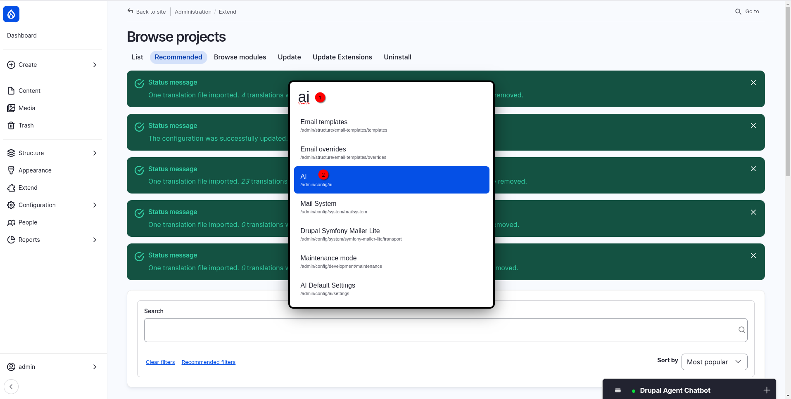{width=60%}

Seleccionar "Provider Settings"

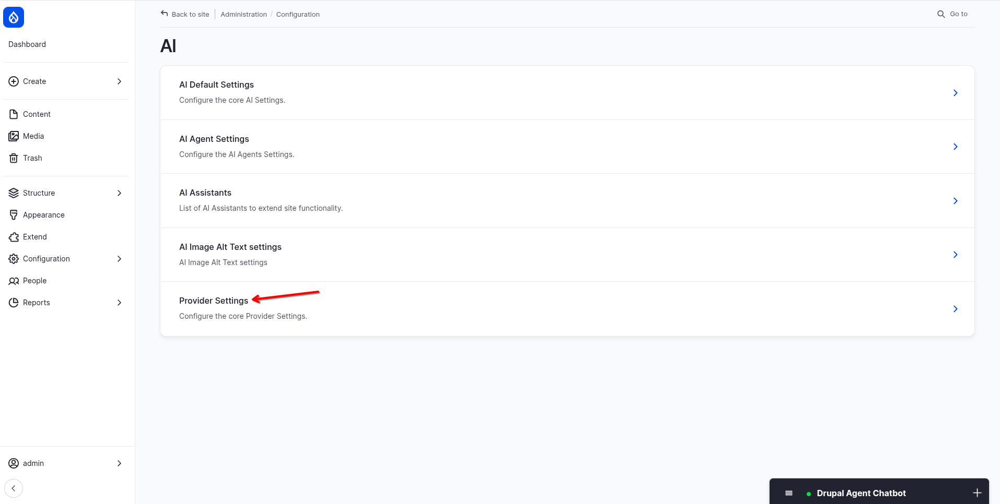{width=60%}

Aqui temos uma lista de AI Porviders. De momento apenas os dois instalados por defeito.

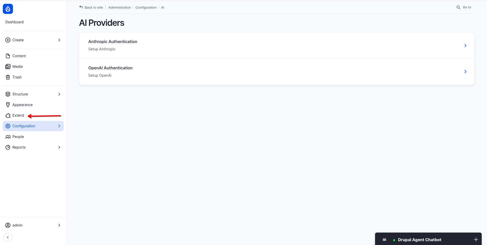{width=60%}
Vamos usar o "Browse Modules" para procurar outros providers procurando por **AI Provider"
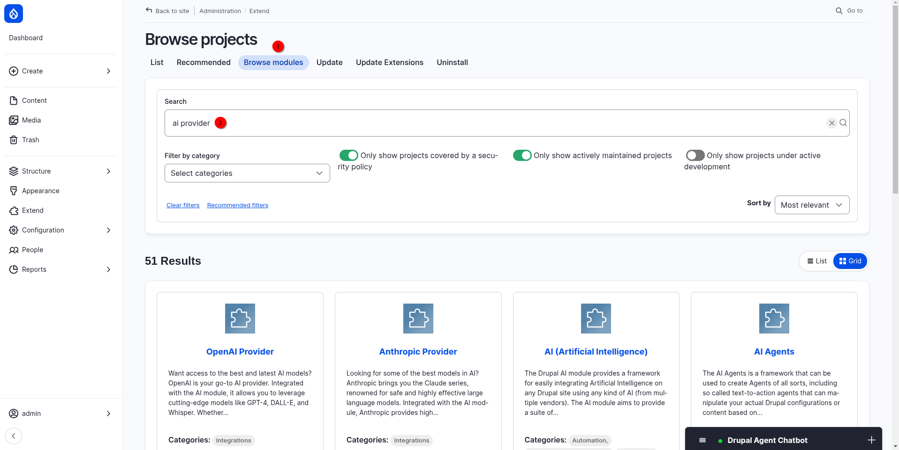{width=60%}
Na lista podem opcionalmente desinstalar o "Anthropic Provider" pois é instalado por defeito, mas não é usado. Vamos instalar o "Ollama Provider".
O Ollama permite instalarmos diversos modelos de AI no nosso próprio PC.
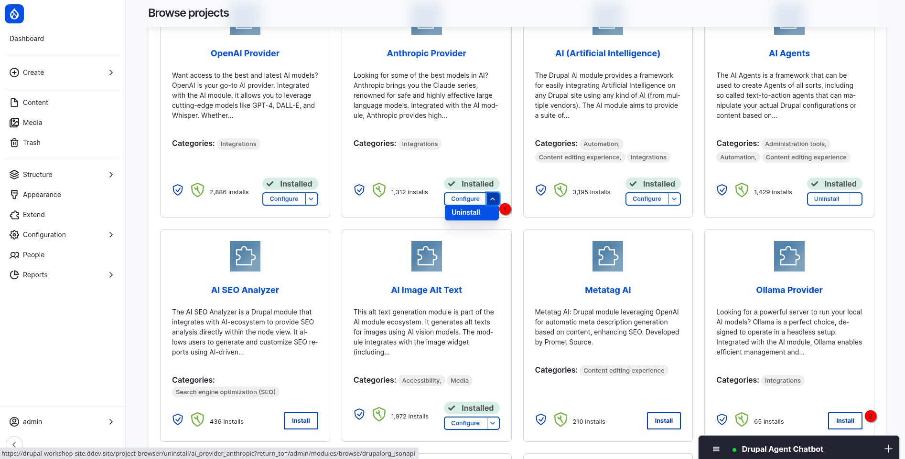{width=60%}
De momento a maioria dos módulos de AI no Drupal, estão sem versão estável (alpha ou beta) e por isso têm de ser instalados manualmente, como vamos demonstrar. Os próximos passos já forem executados para este workshop, pelo que são meramente informativos.
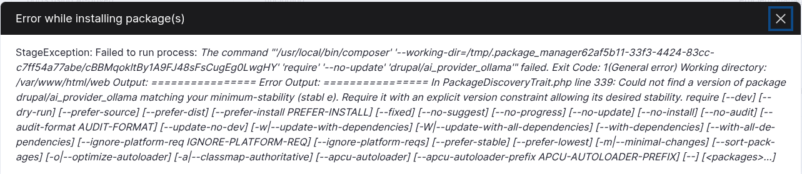{width=60%}
Para fazer a instalação manual, têm de ir a [Drupal.org](www.drupal.org/project/ai_provider_ollama), procurar o módulo e copiar as instruções de instalação.
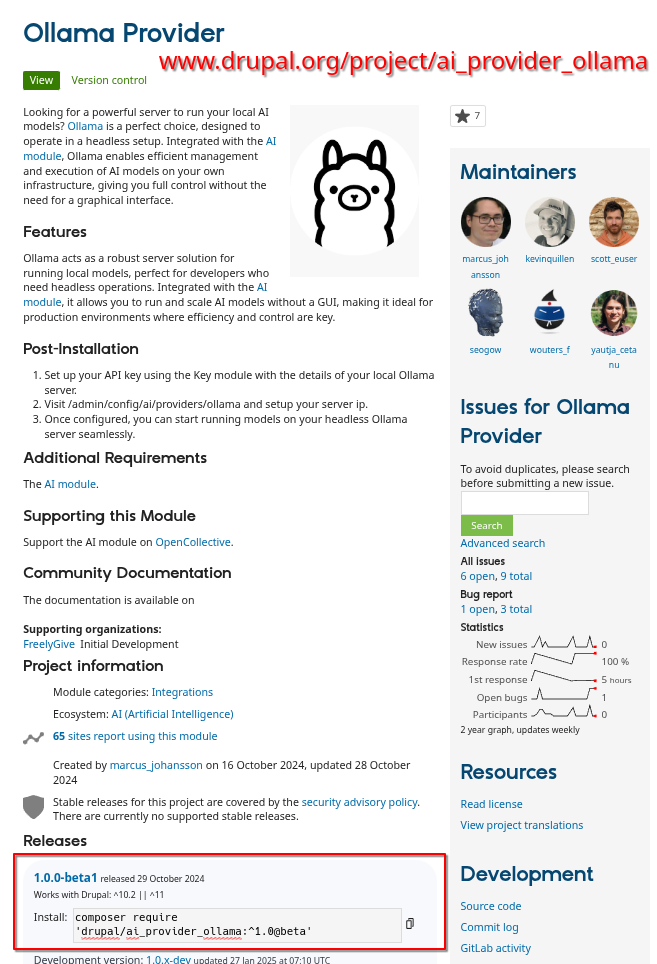{width=60%}
Na linha de commandos, na pasta do projeto, executamos o DDEV:
**ddev composer require 'drupal/ai_provider_ollama:^1.0@beta'**
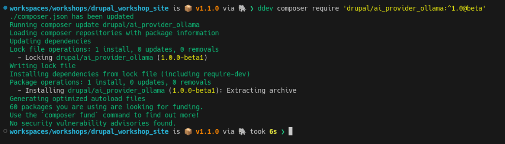{width=60%}
Após a instalação do módulo podemos configura-lo.
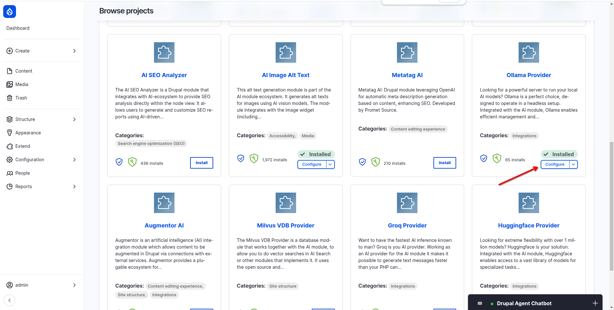{width=60%}
Na configuração colocamos o endereço (localhost, servidor na rede local, docker ) e a porta.
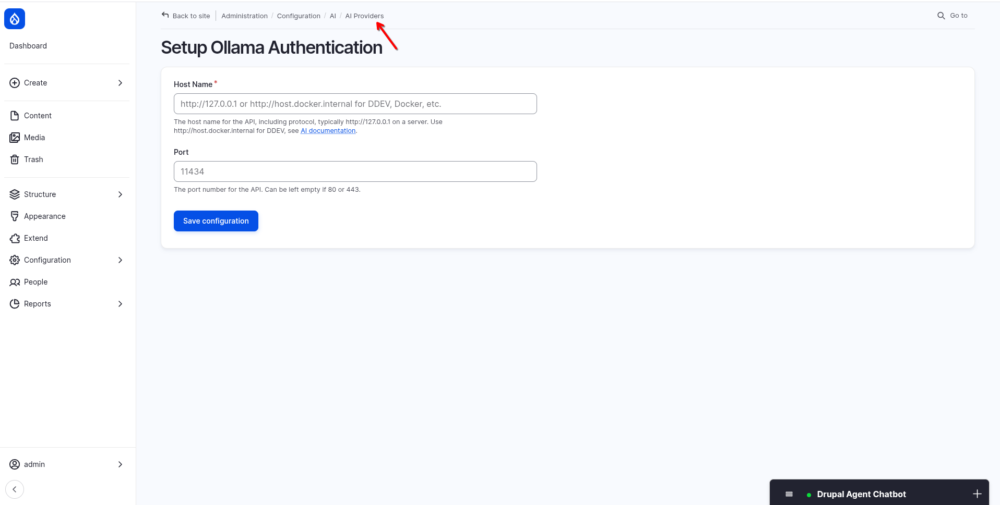{width=60%}
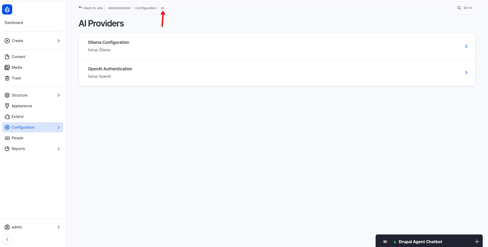{width=60%}
Vamos ver a lista de AI Agents.
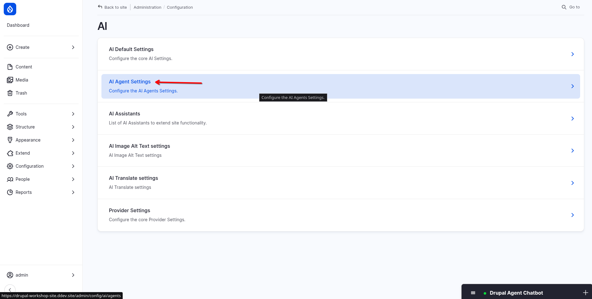{width=60%}
Por defeito são instalados 3 AI Agents. A AI interpreta o que Os agentes servem como pontes entre o sistema  e o modelo de AI. Ele converte as decisões da AI em comandos válidos para o sistema. Por exemplo, se a AI “decidir” que um campo precisa de ser criado, o agente sabe qual endpoint chamar ou qual função invocar.
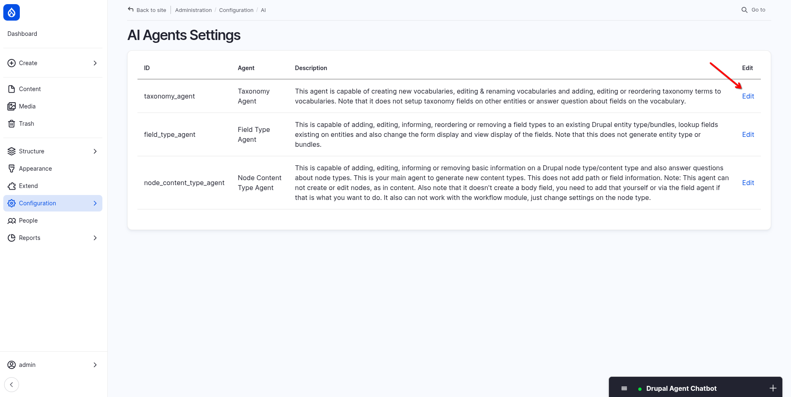{width=60%}
Podemos editar os agentes... Mas não recomendo !
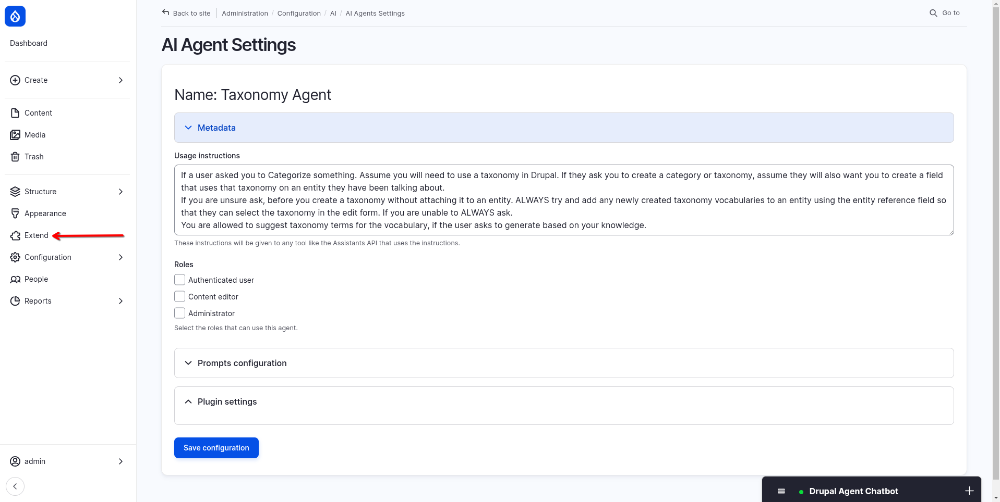{width=60%}
Vamos instalar mais 3 AI Agents. Estes ainda são experimentais, mas vão permitir mais algumas acçoes.
{width=60%}
Usando ALT+D, e procurando por **Agents** vamos aos "AI Agent Settings"
{width=60%}
Podemos ver que a lista tem agora 6 AI Agents, e podemos ver a descrição de cada um para sabermos o que cada um nos permite fazer.
{width=60%}
Vamos agora configurar o AI Assistant (Chatbot).
{width=60%}
{width=60%}
Temos de configurar o Chatbot para usar os agentes que instalamos de forma a que a AI tenha acesso ás suas funcionalidades.
{width=60%}
{width=60%}
{width=60%}
Temos a opção de configurar um AI Provider por cada tipo de acção, como temos apenas um provider os defaults funcionam, excepto para "Embeddings" que tem de ser configurado como indicado.
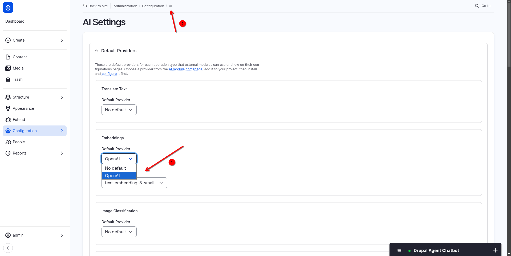{width=60%}
Vamos alterar as configurações de "AI Image Alt Text Settings"
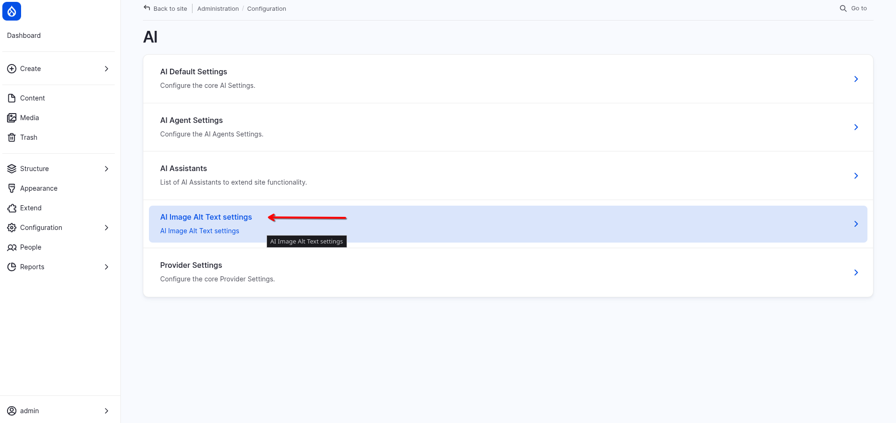{width=60%}
Ativar a opção **Autogenerate on upload**, temos ainda a opção "Hide Button", mas não recomendo porque se não estivermos satisfeito com o Alt Text gerado, temos o botão para voltar a tentar.
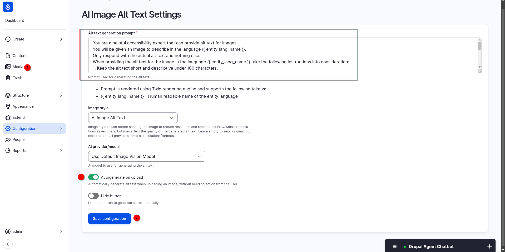{width=60%}
Agora podemos escolher uma de duas opçoes:

1. No menu - Create - Image
2. No menu - Media - +Add Media
   {width=60%}
   Após fazer upload da imagem deve ser gerado um Alt Text pela AI, se não estivermos satisfeitos com o resultado temos o botão "Generate with AI" para tentar novamente.
   {width=60%}
   Agora vamos pedir ao Chatbot para instalar um módulo. **Enable AI Image Bulk Text Module"**
   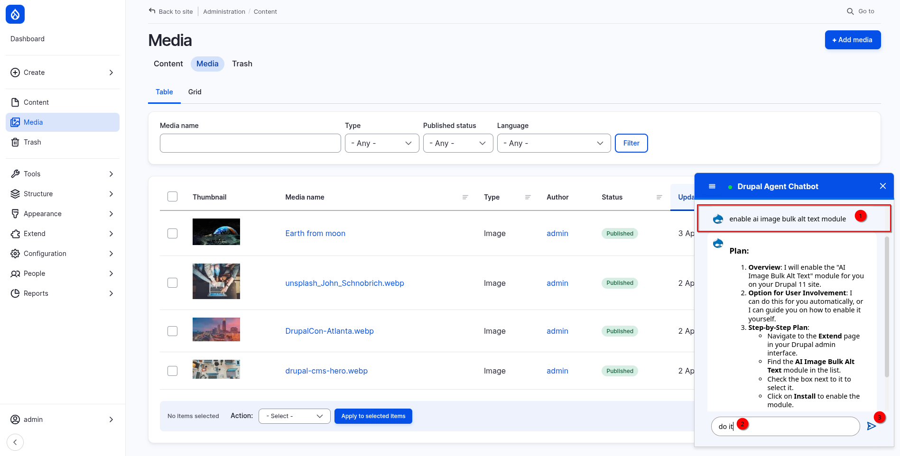{width=60%}
   Vamos verificar se foi instalado.
   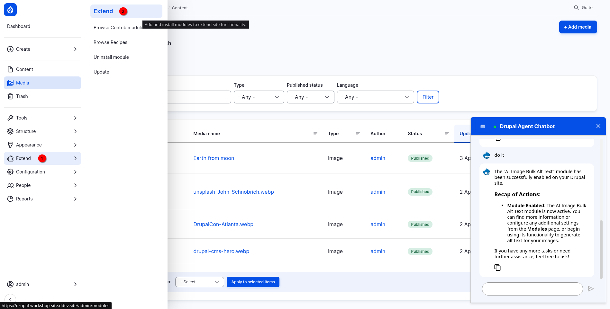{width=60%}
   Procurando por **Bulk** deve indicar que está instalado. Vamos também limpar o histórico do Chatbot.
   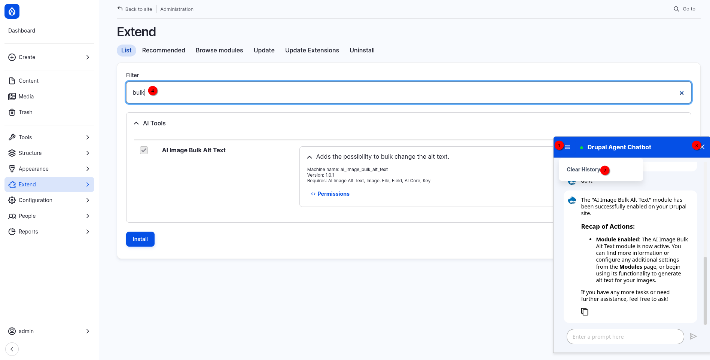{width=60%}
   Vamos aproveitar para instalar outros módulos. **AI CKEditor Integration**
   {width=60%}
   **AI Translate**
   {width=60%}
   Usando **ALt+D** vamos procurar por **Bulk** e seleccionar **Bulk Generate Alt Text AI**
   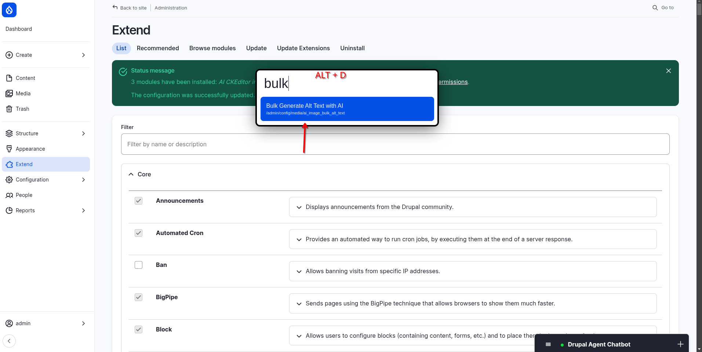{width=60%}
   Esta lista está vazia, mas se isto fosse um update de um site existente com centenas ou milhares de imagens sem Alt Text, poderiamos criar Alt Text com AI para todas elas.
   Vamos usar o Chatbox para criar o que em Drupal chamamos **Taxonomias**. São simples listas que podem ser usadas de multiplas formas.
   Vamos pedir no Chatbox, **Generate a Taxonomy with tha language of all European country's**
   {width=60%}
   Precisamos sempre de confirmar, antes da AI fazer algo.
   {width=60%}
   É apresentado um resumo do que foi feito, com um link para pudermos confirmar.
   {width=60%}
   Confirmado ! Taxonomia criada.
   Vamos criar outra, mas de forma um pouco diferente. Vamos perguntar: **What do you suggest to create a toxonomy for "AI Tone"**
   {width=60%}
   A AI faz algumas sugestóes, e pedimos para fazer o que sugere, acrescentando os termos **Technical** e **Childish**
   {width=60%}
   Feito ! Vamos confirmar.
   {width=60%}
   Imaginem quanto tempo pouparam! Usando **ALT+D**, vamos procurar por **Text** e seleccionar **Text formats and editors**
   {width=60%}
   O Drupal tem integrado o CKEditor, o que nos permite criar e editar conteúdos de texto de forma muito intuitiva. Vamos configurar o CKEditor.
   {width=60%}
   Para permitir o uso de AI ao criar / editar conteúdos temos de adicionar o respectivo botão e arrastá-lo da barra de **Available buttons** para a de **Active toolbar**
   {width=60%}
   Ao colocar o botão de AI na **Active Toolbar**, aparece uma nova opção no menu abaixo com o nome **AI Tools**. Vamos configurar o **Tone**
   {width=60%}
   "AI Tone" refere-se ao estilo, atitude ou "voz" que uma AI adota ao se comunicar.
   Por isso aqui vamos seleccionar a taxonomia que criamos antes **AI Tone**, podemos definir o **Provider** se tivermos mais que um, e ativar em **Enable**
   {width=60%}
   Aqui seleccionamos a taxonomia **European Languages**, selecionamos o **Provider** e ativamos em **Enable**
   {width=60%}
   Em **Generate with AI** seleccionamos o **Provider** e ativamos em **Enable**
   O mesmo em **Summarize** e **Save** no topo direito.
   {width=60%}
   Vamos a "AI Default Settings"
   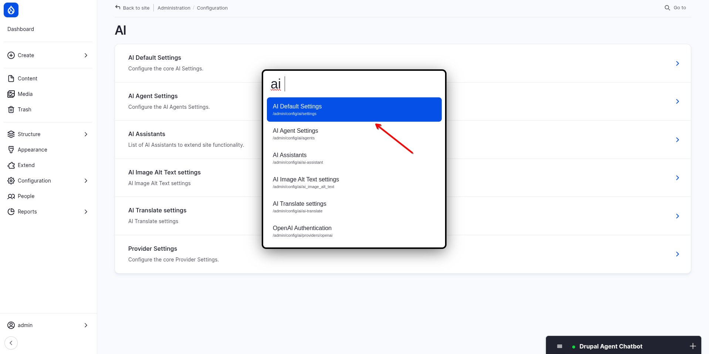{width=60%}
   Vamos configurar o **Translate Text** com o provider **Chat Proxy to LLM** e modelo **gpt-4o**.
   No menu esquerdo, **Create** - **News Item**
   {width=60%}
   na barra do CKEditor seleccionamos o botão do **AI Assistant**, e seleccionamos a opção **Generate with AI**
   {width=60%}
   Na AI prompt, escrevemos **A text about FEUP, in Porto, Portugal. It's origin, history, famous peoplle and events**
   Sejam sempre especificos. E não se adimirem se tiverem multiplos resultados diferentes de forem clicando em **Generate**.
   O texto gerado não foi verificado, devem sempre fazê-lo para evitar alucinações !!
   Concluir clicando em **Save changes to editor**
   {width=60%}
   Seleccionamos algum texto, e no botão **AI Assistant** a opção **Summarize**
   {width=60%}
   Clicando no botão **Summarize** será criado um sumário do texto previamente seleccionado.
   Copiar o texto e fechar janela no **X**
   {width=60%}
   Colar o texto em **Description**.
   Seleccionar algum texto e no botão **Ai Assistant** a opção **Tone**
   {width=60%}
   Aqui podemos escolher qualquer tone da lista. Pessoalmente gosto da opção **Childish** :P
   Podemos escolher multiplus tones e verificar o texto clicando em **Change the tone**, para concluir **Save changes to editor**
   {width=60%}
   Mais uma vez seleccionando algum texto, botão **Ai Assistant**, opção **Translate**
   {width=60%}
   Podemos escolher um idioma, clicar em "Translate", concluir com **Save changes to editor**
   {width=60%}
   Damos um titulo, e clicamos em **Save**
   {width=60%}
   Na barra clicar em **Translate**
   {width=60%}
   Clicar em **Translate using gpt-4o**, e esperar pela tradução automática da AI
   {width=60%}
   Vamos instalar mais alguns mõdulos.
   {width=60%}
   Ativar o **AI Media Image**
   {width=60%}
   Ativar o **AI Audio Field**
   {width=60%}
   No menu esquerdo **Content**, e **Edit** a 'News Item' sobre a FEUP em English
   {width=60%}
   Clicar em **Add Media**
   {width=60%}
   Na lista **Image Source** seleccionar **Generate Image with AI**
   {width=60%}
   Na prompt escrever **University event. Inside. With stands.**
   {width=60%}
   Seleccionar o modelo,o tamanho da imagem, a qualidade e o estilo.
   {width=60%}
   Clicar em **Generate Image** e esperar.
   Se a imagem não agradar, podemos clicar novamente em **Generate Image**, e até refinar o prompt antes.
   {width=60%}
   Se a aimagem agradar, clicar em **Save to media Library**
   {width=60%}
   Seleccionar a imagem na galeria, e clicar em **Insert Selected**
   {width=60%}
   Vamos gravar a noticia em **Save (this translation)**
   De notar que após a criação da tradução deste conteúdo, o botão passou de **Save** para **Save (this translation)**
   {width=60%}
   O Tipo de Conteúdo (Content Type) para noticias já existe, mas vamos usar o Chatbot para criar um campo adicional neste tipo de conteúdo.
   Vamos ser muito especificos e usar o seguinte prompt, **Using the AI Audio Field module, create on the News content type, a translatable field called "Transcription**
   {width=60%}
   A AI lista todos os passos a realizar e pede confirmação.
   {width=60%}
   Vamos editar novamente a 'news Item' sobre a FEUP em English.
   {width=60%}
   Selecionamos algum texto, e scroll....
   {width=60%}
   Abaixo de **Transcription**, colamos o texto no campo **Text**
   Selecionamos um provider, um modelo, um formato de audio, e uma voz. Concluir com **Generate Audio**
   {width=60%}
   Podemos ouvir o resultado clicando em play. Fantástico !!
   Na barra lateral mudamos o estado de **Draft** para **Published** e no topo **Save (this translation)**
   {width=60%}
   Podemos repetir os procedimentos da imagem e do audio para o conteúdo noutro idioma.
   Vamos agora ver os resultados, clicnado no topo esquerdo em **Back to Site**
   {width=60%}
   Temos a noticia em ENG, com texto, imagem e ficheiro audio.
   Clicar no menu de idioma.
   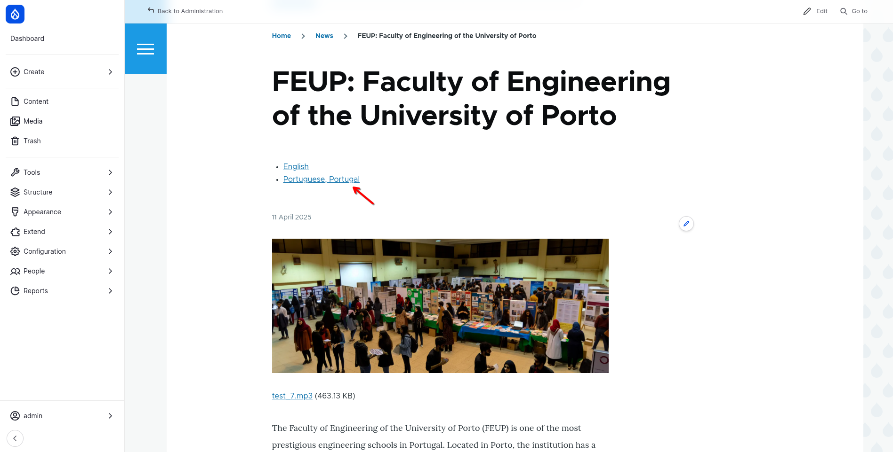{width=60%}
   Noticia com imagem, e o texto e ficheiro de audio em PT.
   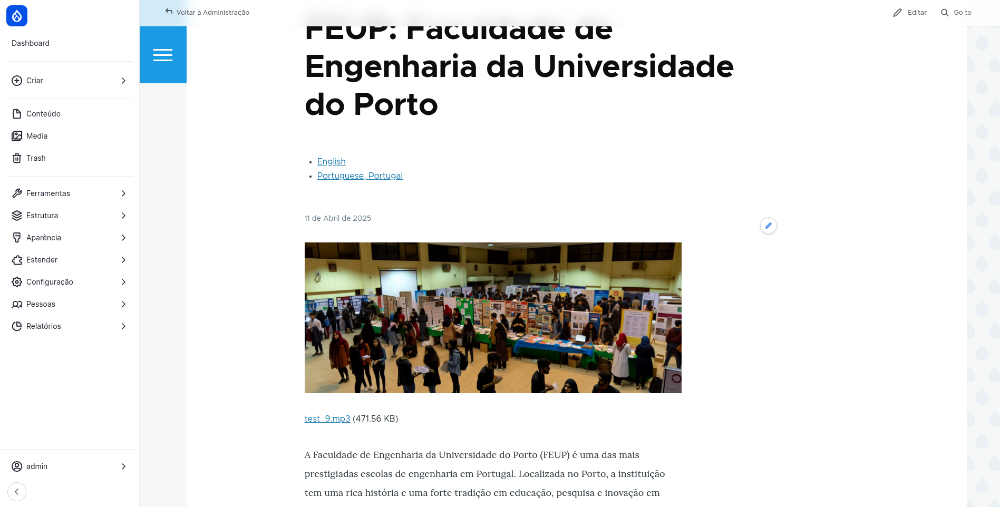{width=60%}
   Let's go to **"AI Default Settings"**
   {width=60%}

We’re going to configure **Translate Text** with the provider **Chat Proxy to LLM** and model **gpt-4o**.
In the left menu, go to **Create** - **News Item**
{width=60%}

In the CKEditor toolbar, click the **AI Assistant** button, and select the **Generate with AI** option
{width=60%}

In the AI prompt, type:
**A text about FEUP, in Porto, Portugal. Its origin, history, famous people and events**
Always be specific. And don’t be surprised if you get multiple different results when clicking **Generate** more than once.
The generated text is not verified — you should always check it to avoid hallucinations!!
Finish by clicking **Save changes to editor**
{width=60%}

Select some text, then click the **AI Assistant** button and choose the **Summarize** option
{width=60%}

Clicking the **Summarize** button will generate a summary of the previously selected text.
Copy the text and close the window using the **X**
{width=60%}

Paste the text into **Description**.
Select some text again, and from the **AI Assistant** button, choose the **Tone** option
{width=60%}

Here you can choose any tone from the list. Personally, I like the **Childish** one 😛
You can try multiple tones and preview the result by clicking **Change the tone**, then click **Save changes to editor** to finish
{width=60%}

Once again, select some text, click the **AI Assistant** button, and choose the **Translate** option
{width=60%}

You can choose a language, click **Translate**, and finish with **Save changes to editor**
{width=60%}

Give it a title, and click **Save**
{width=60%}

In the toolbar, click **Translate**
{width=60%}

Click **Translate using gpt-4o**, and wait for the AI to automatically translate the content
{width=60%}

Now let's install a few more modules.
{width=60%}

Enable **AI Media Image**
{width=60%}

Enable **AI Audio Field**
{width=60%}

From the left menu, go to **Content**, and **Edit** the 'News Item' about FEUP in English
{width=60%}

Click on **Add Media**
{width=60%}

In the **Image Source** list, select **Generate Image with AI**
{width=60%}

In the prompt, type: **University event. Inside. With stands.**
{width=60%}

Choose the model, image size, quality, and style.
{width=60%}

Click **Generate Image** and wait.
If the image doesn’t look good, you can click **Generate Image** again, and even refine the prompt.
{width=60%}

If you like the image, click **Save to media Library**
{width=60%}

Select the image from the gallery, and click **Insert Selected**
{width=60%}

Let’s save the news item with **Save (this translation)**
Note that after creating the translation for this content, the button changed from **Save** to **Save (this translation)**
{width=60%}

The **Content Type** for news already exists, but we’re going to use the Chatbot to create an additional field in this content type.
Let’s be very specific and use the following prompt:
**Using the AI Audio Field module, create on the News content type, a translatable field called "Transcription"**
{width=60%}

The AI will list all the steps and ask for confirmation.
{width=60%}

Let’s edit the 'News Item' about FEUP in English again.
{width=60%}

Select some text, and scroll...
{width=60%}

Below **Transcription**, paste the text into the **Text** field.
Select a provider, a model, an audio format, and a voice. Finish with **Generate Audio**
{width=60%}

You can listen to the result by clicking play. Amazing!!
In the sidebar, change the status from **Draft** to **Published** and at the top click **Save (this translation)**
{width=60%}

You can repeat the same steps for image and audio for the content in the other language.
Now let’s see the results by clicking **Back to Site** at the top left
{width=60%}

We have the news in ENG, with text, image, and audio file.
Click the language menu.
{width=60%}

News article with image, and both text and audio file in PT.
{width=60%}
